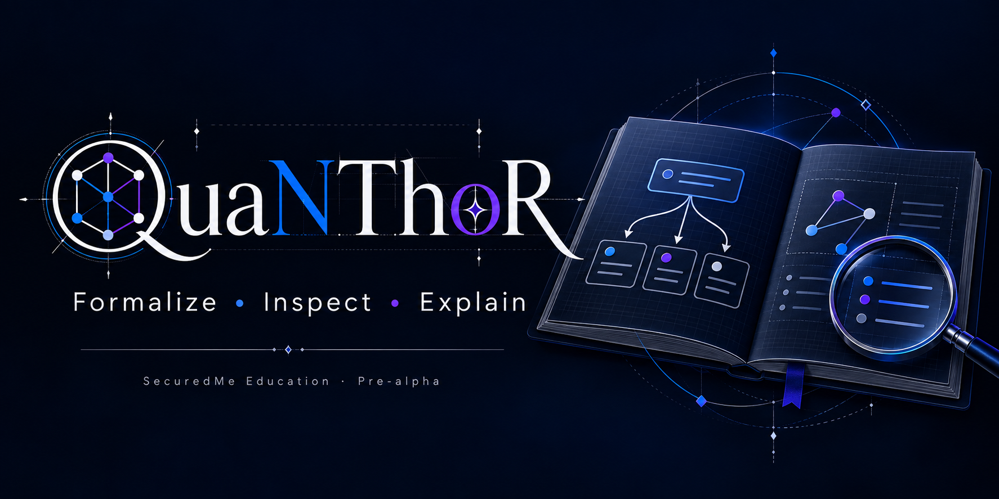

# QuaNThoR



[](LICENSE)
[](AGENTS.md)
[](https://github.com/SeCuReDmE-main-dev/QuaNThoR/issues)
[](https://github.com/SeCuReDmE-main-dev/QuaNThoR/commits/main/)
[](https://e2b.dev/startups)

Étudier la vérification formelle, la relecture et les contrats de recherche avec des résultats inspectables.

[Public surface](https://quanthor.securedme.ca/) · [Tool documentation](https://securedme-main-dev.github.io/securedme-scholarium/en/tools/quanthor/) · [Education hub](https://securedme.ca/product/education/)

**Status:** pre-alpha, active public development. Public pages and a successful local test do not establish a deployed school service. E2B sponsorship recognition is separate from runtime availability and included quota.

## How it works

Les routes locales séparent la vérification, la proposition et la relecture. La disponibilité de chaque moteur doit être observée ; une réponse rédigée ne constitue pas une preuve formelle.

## Local development

Record the checkout and existing changes before editing:

```powershell
git status --short --branch
git rev-parse HEAD
```

Review the source entry points and repository-specific requirements linked below before installing. Optional container, model, API and infrastructure routes require separate availability checks. Do not start external services or copy private environment files into a classroom checkout.

Run the relevant local checks from the repository root; the indicated `Set-Location` is needed only when starting from that root:

```powershell
python scripts/docgen.py check
```

## Source map

- [src](src)
- [scripts/docgen.py](scripts/docgen.py)
- [INSTALL_QUANTHOR.bat](INSTALL_QUANTHOR.bat)
- [START_QUANTHOR.bat](START_QUANTHOR.bat)
- [docker-compose.yml](docker-compose.yml)

## Practice exercise

Choisir un exemple Mizar borné et comparer la réponse du vérificateur avec une simple relecture. Expliquer ce que chaque réponse prouve réellement.

During an individual course, learners choose suite tools to practice. The eight-week final project is the learner's own tool, submitted by the learner to an eligible hackathon after checking its age, AI, originality and licensing rules.

## Boundaries and privacy

Les backends optionnels et l’authentification réelle restent à valider. Une ancienne consigne Docker ou un rapport de disponibilité ne prouve pas que le moteur fonctionne aujourd’hui.

The official school routes are Codex/OpenAI and Antigravity/Gemini with human review. Never distribute raw tokens, learner data, prompts or private correspondence. No hidden learner analytics are added. Public analytics require explicit consent; general autocapture and session replay remain disabled. Optional local technical telemetry is separate from learner records and product audit history.

See [AGENTS.md](AGENTS.md) and [SCHOOL_TOOL_GOVERNANCE.md](SCHOOL_TOOL_GOVERNANCE.md) for current authority and provider boundaries. Maintainer-authorized maintenance follows repository protections and required reviews. General contribution restrictions remain governed by [CONTRIBUTING.md](CONTRIBUTING.md).

## License, authorship and history

The repository's actual license is [SEL-2.0](LICENSE). Keep the license, attribution, notices and safety boundaries when reusing the code.

Jean-Sebastien Beaulieu · [ORCID 0009-0007-2904-0443](https://orcid.org/0009-0007-2904-0443) · [SecuredMe](https://securedme.ca/)

[README source before curation](docs/archive/README-before-curation-2026-09-30.txt) retains the exact previous text, implementation journals and attribution. It is historical: its old telemetry commands, readiness claims and contribution dates are not current operating instructions. [Presentation history](docs/repository-presentation-history-2026-09-30.md) retains previous badges. [GitHub social image](docs/assets/repository/github-social-preview-2026.jpg) accompanies this README.
